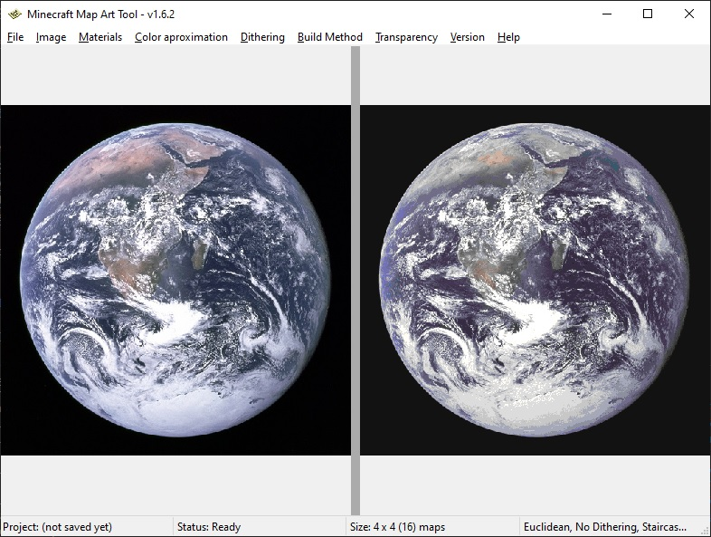

# ImageToMapMC

[](https://github.com/AgustinSRG/ImageToMapMC/actions/workflows/build-windows.yml)
[](https://github.com/AgustinSRG/ImageToMapMC/actions/workflows/build-linux.yml)
[](./LICENSE)


This is a tool for converting images to Minecraft maps, in order to import images into the game without using mods.

Written in C++ as a desktop application for Windows and Linux.

## Installation

In order to install the tool, go to the [releases](https://github.com/AgustinSRG/ImageToMapMC/releases) section in this repository and download the binaries for your system.

If there are no binaries available for your system, you can always compile them from the source code.

## Guides

 - [Basic Guide](./guides/basic_guide.md)
 - [Export as map files and import them into your world (Creative mode)](./guides/export_as_maps.md)
 - [Build the map inside a survival world or server](./guides/export_as_structures.md)

## Reference documentation

 - [Map item format - Minecraft Wiki](https://minecraft.wiki/w/Map_item_format)
 - [Sponge Schematic Specification](https://github.com/SpongePowered/Schematic-Specification/blob/master/versions/schematic-3.md)

## Screenshots



")

## Building from source code

In order to compile the project, you'll need the following:

 - A C++ compiler
 - [CMAKE](https://cmake.org/install/) installed.
 - [ZLIB](https://zlib.net/) installed and available for your C++ compiler.
 - [wxWidgets](https://www.wxwidgets.org/) installed and available for your C++ compiler.
 - [libzip](https://libzip.org/) installed and available for your C++ compiler.

In order to build the release version with CMAKE use:

```sh
cmake -DCMAKE_BUILD_TYPE=Release -Ssrc -Brelease

cmake --build release --config Release
```

After it is successfully built, your binaries will be available in the `release` folder.

### Specific library installation instructions for Windows

Make sure [Visual Studio](https://visualstudio.microsoft.com/) is installed. Preferably the latest version. Ensure the build tools for C++ are also installed.

Once installed, set the `MSVC_CRT_DLL_PATH` environment variable to the path where the dll files for the Visual Studio C++ runtime are located. Example value: `C:\Program Files\Microsoft Visual Studio\2022\Community\VC\Redist\MSVC\14.44.35112\x64\Microsoft.VC143.CRT`.

For external dependencies, use [VCPKG](https://github.com/microsoft/vcpkg). Make sure to install it and configure it for CMAKE, which also needs to be installed.

Install the required libraries:

```sh
vcpkg install wxwidgets zlib libzip --triplet=x64-windows
```

### Specific library installation instructions for Linux

Install the C++ dependencies via APT:

```sh
sudo apt install zipcmp zipmerge ziptool zlib1g-dev libzip-dev libgtk-3-dev libglew-dev libwxgtk3.2-dev
```

You'll also need the `tar` tool in order to package the project:

```sh
sudo apt install -y tar
````
