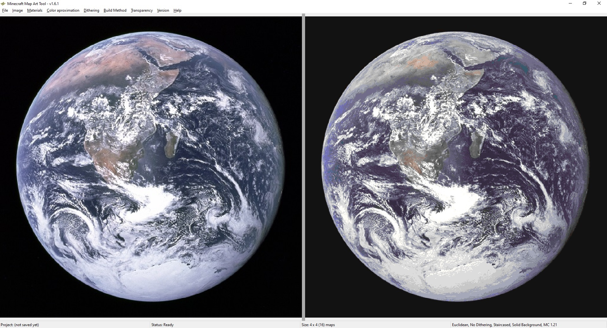

# ImageToMapMC

This is a tool for converting images to Minecraft maps, in order to import images into the game without using mods.

Written in C++ as a desktop application for Windows, Linux and Mac.

# Installation

In order to install the tool, go to the [releases](https://github.com/AgustinSRG/ImageToMapMC/releases) section in this repository and download the binaries for your system.

# Guides

 - [Basic Guide](./guides/basic_guide.md)
 - [Export as map files and import them into your world (Creative mode)](./guides/export_as_maps.md)
 - [Build the map inside a survival world or server](./guides/export_as_structures.md)

# Screenshots



")

# Building from source code

In order to compile the project, you'll need the following:

 - A C++ compiler
 - [CMAKE](https://cmake.org/install/) installed.
 - [ZLIB](https://zlib.net/) installed and available for your C++ compiler.
 - [wxWidgets](https://www.wxwidgets.org/) installed and available for your C++ compiler.

In order to build the release version with CMAKE use:

```sh
cmake -DCMAKE_BUILD_TYPE=Release -Ssrc -Brelease

cmake --build release --config Release
```

After it is successfully built, your binaries will be available in the `release` folder.
