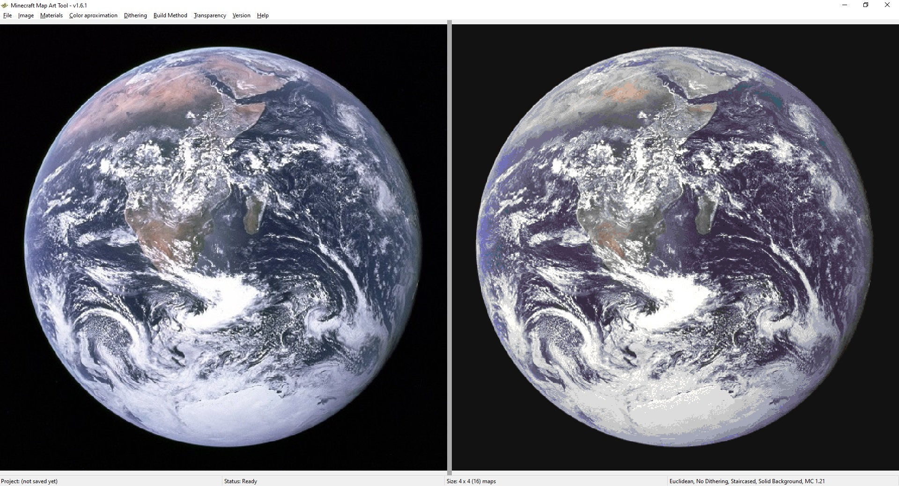

# Basic Guide

The app main interface consists of two panels:
 - At the **LEFT**, the original image is displayed.
 - At the **RIGHT**, a preview of the map (how it will look in game) is displayed.

All of the options are available in the application top menu.

## Load an image

The first step is loading an image, to do that:
 - Go to the menu: **Image > Load Image** and select an image file from your computer.
 - You can also drag and drop an image file and it will be loaded.

## Resize the image

Minecraft maps have a fixed resolution of 128x128 pixels. There is no way to change it in the vanilla game, so the image has to fit inside a whole number of maps.

To achieve this, the application adds a padding to the image, with white as the default color.

You can resize the image directly using the app, to do that go to the menu: **Image > Resize Image**

## Modify original image

Maybe you want to modify the original image before converting into a map, like changing the background color, the saturation, brightness or contrast.

This is a common practice to make the map look better, to do that, go to the menu: **Image > Image Settings**

## Choose a build method

Once you selected the image you want, you have to decide how do you want to build your map. Depending on your permissions in the world or server your are playing, you may choose:

 - **None** - Choose this if you have full access and you do not want to build it, you just want to create the `.dat` map files so you can directly import them in your world or server. **This gives access to all the available colors**
 - **Staircased** - Choose this method if you want to build the map in survival, and you want a difficulty balance. This method creates the map with staircases of blocks, with only single block jumps in height. **This gives access to 75% of the available colors**
 - **3D (Complex)** - Choose this one if you don't care about difficulty. This is the same as staircased, but with arbitrary jusmps in height, making it more compact but really hard to build. **This gives access to 75% of the available colors**
 - **Flat** - Choose this one if you want a simple build. This is ideal if you want to manually modify it in creative, however it drastically reduces the amount of colors. **This gives access to 25% of the available colors**

To change this option, use the menu: **Build Method**

## Choose the version

In the **Version** menu, choose the version you are building the map in. 

This is important to change the available blocks. This also changes the format of the files you export, so it's really important you choose the right version.

## Customize the materials

In the menu **Materials > Customize Materials** you have a list of materials. 

You can customize it by enabling and disabling materials (this also disables or enables colors) and also you can change the materials you want to use for each color.

The preview will change in real time, so you can play with it if you don't have many materials in game.

If you want a list of materials in a text file, go to the menu: **Materials > Export Materials List**

## Apply dithering

Sometimes, due to the low amount of colors available in minecraft maps, there will be a very noticeable difference between the original and the map. 

However, you can use a technique called [Dither](https://en.wikipedia.org/wiki/Dither) to introduce random noise in the image and simulate more colors to the human brain.

To do that, use the menu: **Dithering**

Check the preview to see if it improves. Usually dithering helps more the bigger the image is.

## Save the project

After you made your map look as you want, you may want to save that configuration in case you want to change it later. to do that go to **File > Save Project** and save your project to a file.

You can open it later with **File >  Open Project** or dragging the project file to the application main window.

## Export the result

You can export the result using the menu: **File > Export**

There are two main options:

 - [Export as map files and import them into your world (Creative mode)](./export_as_maps.md)
 - [Build the map inside a survival world or server](./export_as_structures.md)

There is also an extra option to export to minecraft functions. This is only for flat maps in order to place them next to each other. For 3D and staircased maps this won't work due to the height limit.
