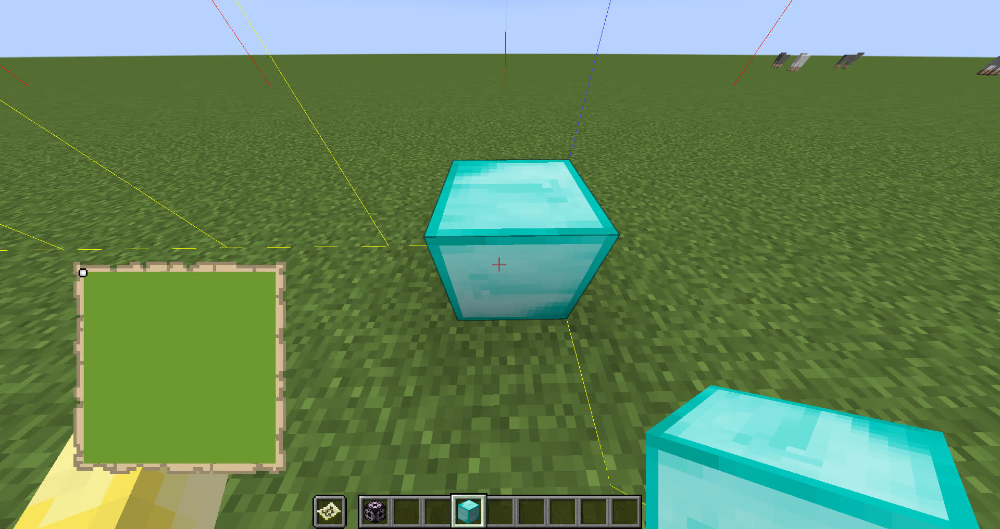
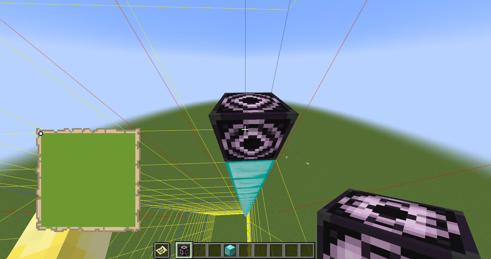
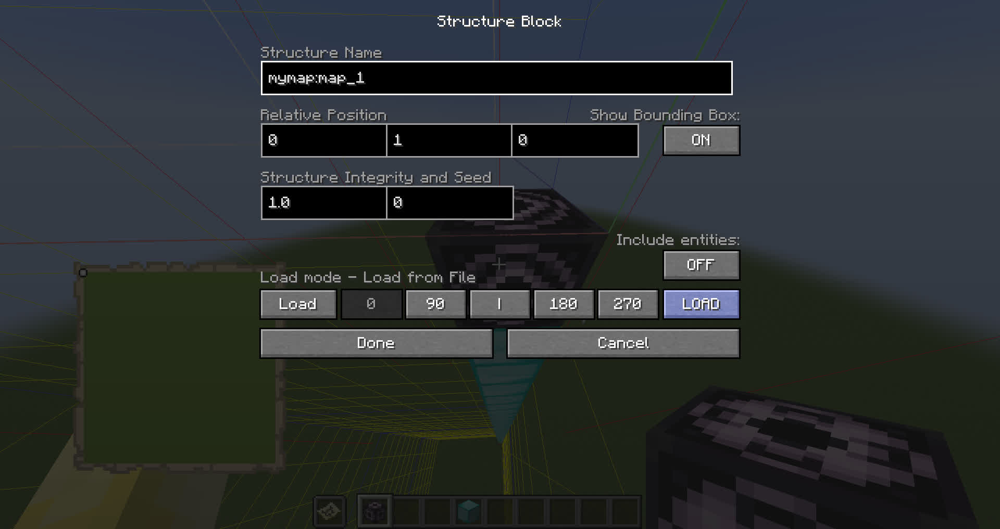

## Build the map inside a survival world or server

In order to build the map inside a survival world you have to create a new creative world and import the map as an structure. Once it is in your creative world, you can copy it to the survival world, either manually or using a client mod, like Schematicas.

Follow these steps in order to get it done.

### 1. Create a creative world

Open the game and go to **Singleplayer > Create New world**

Choose a name for the world.

Put the game mode in **Creative** with cheats on.

Go to **More World Options**

 - Set World type to **Superflat**
 - Set **Generate Structures: OFF**

Now create the world

### 2. Configure the world

Type the following commands in the chat to make your world optimal for this purpose:

```
/difficulty peaceful
/gamerule doMobSpawning false
/gamerule keepInventory true
/gamerule doFireTick false
/gamerule mobGriefing false
/gamerule doDaylightCycle false
/time set day
/weather clear 1000000
```

These commands disable many features that can cause your map to be accidentally griefed while you are copying it.

### 3. Export the map

Using ImageToMapMC, go to the menu: **File > Export > Export as Structures**

Click browse. It should start at your worlds folder, select the one you created.

In namespace put `mymap` or any id you prefer to identify your map in game.

Click Export

### 4. Import your structure

In game, give yourself an structure block:

```
/give @p minecraft:structure_block
```

Also, grab a map from the creative inventory.

Right click the empty map to fill it. Once is filled go to the top and left corner of the map and place one block one block north, just right outside the map limit. You can use F3 + G to see chunk borders so it is easier.

You should be looking north (check F3).



Go up as many blocks as you want, depending on how hight you want to build the map. Usually I prefer using oceans, building it about y = 65



Now place the structure block, and configure it:

 - Put the mode to `Load`
 - In Structure name type: `mymap:map_1`
 - Click `LOAD` in caps
 - Now put a redstone block next to the structure block. The structure will appear after a short lag spike.



### 5 Repeat with every part of the map

Repeat the step 4, changing the structure name to increasing numbers until you do all the maps.

The maps a sorted left to right, top to bottom.

Rememeber to choose a new place for each map.

After you are done, you can now copy the maps into your survival world. You can also check the maps out putting them in item frames.

")

